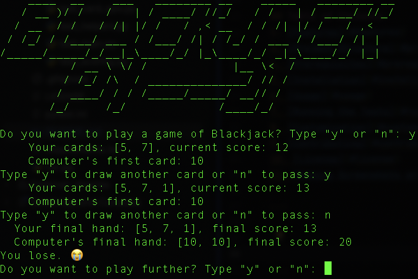
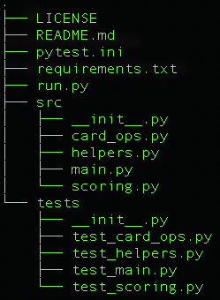

# Blackjack PY -- 21 (Python)

Welcome to **Blackjack PY -- 21**, a Python-based command-line implementation of the classic card game. Play against the dealer and experience the thrill of blackjack with automated scoring and rule handling.

---



---
## Table of Contents
- [Overview](#overview)  
- [Project Structure](#project-structure)
- [Setup](#setup)
  - [Prerequisites](#prerequisites)
  - [Installation](#installation)
  - [Run the Game](#run-the-game)
- [Play](#play)
- [Testcases / QA](#testcases-qa)
  - [Continuous Integration and Deployment (CI/CD)](#ci-cd)
  - [Run Testcases local](#run-testcases-local)
  - [Add Pre-Push Hook](#pre-push-hook)
- [Code Architecture](#code-architecture)  
  - [Design choices](#design-choices)
  - [Game files](#game-files)
  - [Test files](#test-files)
  - [Config files](#config-files)
- [License](#license)  
- [Contact](#contact)

---

## Overview
This Blackjack application follows standard Blackjack rules and features:
- Fully functional blackjack game with rules like "natural 21" and dealer stand/hit logic.
- Cards are drawn from a standard 52-card deck, the deck is reduced.
- Face cards (Jack, Queen, King) count as 10, numeric cards count as their face value, and Aces can be 1 or 11 depending on the player’s best outcome.
- The player competes against the computer (dealer) aiming to get a score as close to 21 as possible without going over.

The project is organized with test coverage (via `pytest`) to ensure reliability and maintainability. It is build using a modular and well-structured Python codebase for easy readability and maintenance.

---

## Project Structure


---

## Setup

### Prerequisites
- Python 3.7+  
- [pip](https://pypi.org/project/pip/) (usually bundled with Python installations)

### Installation
1. Clone the repository and install the required dependencies:
```bash
git clone https://github.com/kenobijr/blackjack-game.git
cd blackjack-game
```
2. Create and Activate a Virtual Environment (recommended)
```bash
# On macOS/Linux
python3 -m venv venv
source venv/bin/activate

# On Windows
python -m venv venv
venv\Scripts\activate
```
3. Install Dependencies
```bash
pip install -r requirements.txt
```
### Run the game
```bash
python run.py
```
---

## Play
The game follows the classic Blackjack rules:

---

### Goal
Reach a hand value as close to 21 as possible without exceeding it (“busting”).

### Card Deck
- French deck with cards: `[2, 3, 4, 5, 6, 7, 8, 9, 10, 10, 10, 10, 11] * 4`.
- Cards are removed from the deck when drawn. A new shuffled deck is created each round.

### Scores
- **Number cards (2–10):** Face value.
- **Face cards (Jack, Queen, King):** 10 points each.
- **Ace:** 1 or 11, whichever benefits the hand most. (1 if hand exceeds 21).

### Blackjack
An Ace + a 10-point card (total 21) in the first round is Blackjack. It beats all hands except another Blackjack.

---

### Gameplay
1. Both the player and computer are dealt two cards.
2. The player’s cards are face up; one of the computer's cards is hidden.
3. If AA is dealt in the first round, one Ace is counted as 1, making the score 12.
4. If **only one** player has Blackjack in the first round, that player wins. If **both** have Blackjack, the computer wins.
5. If no Blackjack occurs, the player decides whether to “hit” (draw another card) or “stand” (keep their current hand).

### Flow of the Player’s Turn:
- Draw a card, replacing Ace with 1 if bust.
  - **If score > 21**: Player busts, game over.
  - **If score ≤ 21**: Player can choose to hit or stand.
  - **Note:** A score of 21 after the first round is not Blackjack.
  - The player can keep drawing even with a score of 21 (though it may be illogical).
  - If the player busts, the computer does not draw further since the player already lost.

### Flow of the Computer’s Turn:
- Computer draws another card if its current score is < 17 and the player hasn’t busted.
  - Replace Ace with 1 if bust.
  - **If bust** or **17 ≤ score ≤ 21**, game ends, and results are evaluated.

---

### End State:
- **Both bust:** Computer wins.
- **One busts:** The other wins.
- **Same score:** Draw.
- **Higher score:** Higher score wins.

---
## Testcases / QA
---
### Continuous Integration and Deployment (CI/CD)
This project utilizes **GitHub Actions** for automated testing and deployment. All `pytest` test cases are automatically executed with every push or pull request to the `main` branch.

**Key CI/CD Features:**
1. Test Automation: The pytest test cases are automatically executed in the CI pipeline for every push or pull request targeting the main branch. 
2. Branch Protection Rules: The main branch is protected, preventing any merges if the test cases fail during the CI workflow. 
3. Environment Consistency: The tests run in a clean environment (ubuntu-latest), ensuring they are reproducible and not dependent on local setups. 
4. Dependency Management: The workflow installs all required dependencies from requirements.txt and ensures the use of the latest Python version (currently 3.12).

For detailed configuration, check the [workflow file](.github/workflows/python-tests.yml).

---
### Run Testcases local
All tests are located in the tests directory and are run with **pytest**:
```bash
# In the project's root directory:
pytest
```
This will automatically discover and run all test files matching the test_*.py pattern as configured in pytest.ini.

---

### Add Pre-Push Hook (macOS)
To ensure that all testcases pass before code is pushed to the remote repository, you can add a Git Pre-Push Hook that automatically runs pytest locally.
#### Setting Up the Pre-Push Hook
1. Copy the pre-push script to .git:
```bash
cp hooks/pre-push .git/hooks/pre-push
   ```
2. If necessary adapt the path of pytest which points to the local .venv:
```bash
# Use the Python inside .venv to run pytest:
./.venv/bin/python -m pytest
   ```
3. Make it executable:
```bash
chmod +x .git/hooks/pre-push
   ```
See the [script](hooks/pre-push) for more details
#### Usage
- On executing "git push" pytest is executed and shows the test results in the terminal before pushing
- If not all testcases pass, the git push will be prevented
---

## Code Architecture

The game architecture uses run.py as the entry point to execute the procedural game logic in main.py, which coordinates player actions, dealer logic, and scoring by invoking modular functions from card_ops.py for deck management, scoring.py for win conditions, and helpers.py for UI interactions. Pytest ensures reliability through comprehensive tests configured via pytest.ini and supported by organized imports through __init__.py.

---
### Design Choices:

- **Procedural Core with Object-Oriented Deck Management**  
   The game's architecture combines procedural logic for the main game flow with an object-oriented approach for managing the deck. The `French_deck` class ensures efficient card handling, preventing duplicates and enabling dynamic deck management.

- **Dedicated Entry Point (`run.py`)**  
   The `run.py` script centralizes the game execution, ensuring a consistent starting point. This design allows the game to be launched from the project root directory, simplifying usability for end users.

- **Test-Friendly Configuration**  
   The inclusion of `pytest.ini` and `__init__.py` files ensures seamless testing and modular imports:
   - `pytest.ini` configures `pytest` to locate tests in the `tests` directory and recognize the `src` directory for imports.
   - `__init__.py` files establish `src` and `tests` as Python packages, improving code organization and import resolution.

- **Modular Code Organization**  
   The project is divided into distinct modules:
   - `card_ops.py`: Handles card-related logic, such as drawing cards and managing Ace values.
   - `scoring.py`: Manages scoring and win condition logic.
   - `helpers.py`: Provides reusable utility functions for the game UI and interactions.
   This structure enhances maintainability and scalability, allowing isolated updates to specific parts of the codebase.

- **Automated Testing with `pytest`**  
   Comprehensive unit tests are included for each module, ensuring the reliability of critical functionality. The test suite verifies deck operations, scoring calculations, and game flow, supporting future development and debugging.

- **Seamless Player Experience**  
   The procedural game loop facilitates an intuitive flow for players, while the modular architecture behind the scenes ensures robust handling of game logic, scoring, and UI interactions.

---
### Game files

---

#### `run.py`
Serves as the entry point for the Blackjack application:
- **`main()`**: Imports and executes the `main()` function from `src.main`, starting the game.
- **Command-line execution**: Allows the game to be launched directly from the terminal by running `python3 run.py` in the project root directory to ensure a consistent execution environment.

---

#### `main.py`
Handling the core game flow:
- **`main()`**: Initializes the game UI and manages the game loop.
- **`run_game()`**: Executes the primary game logic, including player and computer turns.
- **`player_turn()`**: Allows the player to draw cards or pass until they stand or bust.
- **`computer_turn()`**: Ensures the computer plays optimally, drawing cards until its score is at least 17.

---

#### `card_ops.py`
Manages the card deck and player actions:
- **`French_deck`**: Class that simulates a 52-card deck with draw functionality.
- **`replace_ace_by_one()`**: Adjusts Aces from 11 to 1 if needed.
- **`handle_aces_if_needed()`**: Checks and updates the value of Aces when score exceeds 21.
- **`execute_turn()`**: Adds a card to the hand and updates the score, handling Ace values accordingly.

---

#### `scoring.py`
Handles scoring and win condition logic:
- **`calc_score()`**: Calculates the total value of the current hand.
- **`check_blackjack()`**: Determines if either player has Blackjack in the first round.
- **`compare_scores_1st_round()`**: Declares the winner if Blackjack is dealt in the first round.
- **`compare_scores_n_rounds()`**: Compares scores after multiple rounds to declare a winner.

---

#### `helpers.py`
Provides utility functions for UI and system interactions:
- **`init_ui()`**: Clears the screen and displays the game logo.
- **`clear_screen()`**: Clears the console screen (supports Windows, macOS, Linux).
- **`exit_game()`**: Exits the game with a goodbye message.
- **`print_game_stats()`**: Displays the player’s and computer’s cards during gameplay.
- **`print_game_results()`**: Displays the final hand, scores, and winner.

---

### Test files

---

#### `test_main.py`
Tests the core game flow in the `main.py` module:
- **`test_game_initialization()`**: Ensures the game initializes correctly with a new deck and player/dealer hands.
- **`test_player_actions()`**: Verifies the handling of player actions, such as hitting and standing.
- **`test_dealer_logic()`**: Confirms the dealer's behavior adheres to the game rules (e.g., standing on 17 or higher).
- **`test_game_winner()`**: Validates the logic for determining the game winner under various scenarios.

---

#### `test_card_ops.py`
Tests the functionality of the `card_ops.py` module:
- **`test_replace_ace_by_one()`**: Validates that Aces are correctly adjusted from 11 to 1 when necessary.
- **`test_handle_aces_if_needed()`**: Ensures the proper handling of Aces when the score exceeds 21.
- **`test_execute_turn()`**: Confirms that a card is added to the hand and the score is updated correctly, including handling Ace values.

---

#### `test_helpers.py`
Tests the utility functions from the `helpers.py` module:
- **`test_init_ui()`**: Verifies that the UI initializes correctly with the game logo.
- **`test_clear_screen()`**: Ensures the screen-clearing function behaves as expected across different operating systems.
- **`test_exit_game()`**: Confirms that the game exits gracefully with the correct goodbye message.
- **`test_print_game_stats()`**: Validates the display of player and dealer cards during gameplay.
- **`test_print_game_results()`**: Checks that the final game results are displayed accurately.

---

#### `test_scoring.py`
Tests the scoring and win condition logic in the `scoring.py` module:
- **`test_calc_score()`**: Ensures hand scores are calculated accurately, including handling of Aces.
- **`test_check_blackjack()`**: Confirms that Blackjack is correctly identified during the first round.
- **`test_compare_scores_1st_round()`**: Validates winner determination when Blackjack occurs in the first round.
- **`test_compare_scores_n_rounds()`**: Ensures correct comparison of scores across multiple rounds to declare the winner.

---

### Config files

---

#### `pytest.ini`
Configuration file for `pytest`:
- **`testpaths`**: Specifies the `tests` directory as the default location for test discovery.
- **`pythonpath`**: Adds the project root directory (`.`) to the Python path, ensuring modules in `src` are discoverable during testing.

---

#### `__init__.py` (in `src/`)
Initializes the `src` directory as a Python package:
- Ensures that modules in the `src` directory can be imported throughout the project.
- Allows modularization and clean organization of the source code.

---

#### `__init__.py` (in `tests/`)
Initializes the `tests` directory as a Python package:
- Ensures that the test modules can reference each other if needed.
- Enables smooth integration of the `pytest` framework with the test suite.

---

## License
This project is licensed under the MIT License. See the [LICENSE](LICENSE) file for more details.

---

## Contact
Feel free to reach out for collaboration or questions:

https://github.com/kenobijr

[mail](mailto:22.scree_rhino@icloud.com)